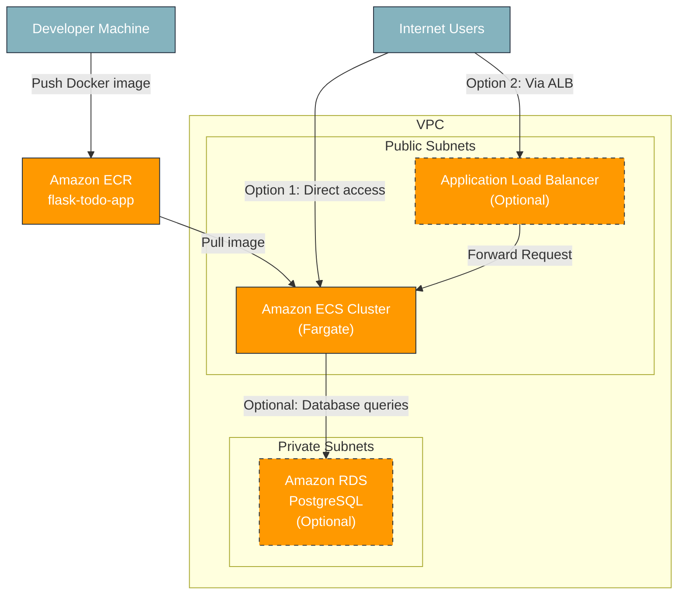

# Flask Todo App - AWS Architecture Diagram

## Architecture Overview

## Component Details

1. **Developer Machine**
   - Builds Docker image locally
   - Pushes image to Amazon ECR

2. **Amazon ECR (Elastic Container Registry)**
   - Stores Docker image for Flask Todo App
   - Provides versioning for container images

3. **Amazon ECS (Elastic Container Service)**
   - Runs containerized Flask application using Fargate (serverless)
   - Manages container deployment, scaling, and health monitoring
   - Task Definition defines container configuration and environment variables
   - Can be accessed directly via public IP if no load balancer is used

4. **Application Load Balancer (Optional)**
   - Routes incoming HTTP traffic to ECS tasks
   - Performs health checks on containers
   - Enables scaling across multiple containers
   - Provides a single, stable endpoint for the application

5. **Amazon RDS (Optional)**
   - PostgreSQL database for persistent storage
   - Stores task data instead of SQLite
   - Connected via DATABASE_URL environment variable

6. **VPC Configuration**
   - Public subnets for ECS tasks and Load Balancer
   - Private subnets for RDS database (if used)
   - Security groups control access between components

## Data Flow

### With Load Balancer (Option 1)
1. User sends request to the application via Load Balancer
2. Load Balancer forwards request to an available ECS task
3. ECS task processes the request using the Flask application
4. Application interacts with the database (SQLite or RDS)
5. Response is returned to the user through the Load Balancer

### Direct Access (Option 2)
1. User sends request directly to an ECS task's public IP
2. ECS task processes the request using the Flask application
3. Application interacts with the database (SQLite or RDS)
4. Response is returned directly to the user

## Security Considerations

- When using a Load Balancer: ECS tasks can be configured to accept traffic only from the Load Balancer
- Without a Load Balancer: ECS tasks need public IPs and security groups that allow direct access
- RDS database runs in private subnets with access only from ECS tasks
- Security groups restrict traffic between components
- IAM roles control permissions for ECS tasks